# RTNeural Comparisons

This repository contains an executable for comparing the performance
of C++ neural network inferencing engines. Currently, there are three
inferencing engines being compared:

- [RTNeural](https://github.com/jatinchowdhury18/RTNeural) (compile-time API)
- RTNeural (run-time API)
- [libtorch](https://pytorch.org/cppdocs/)

## Results
All benchmarks results were obtained on a Macbook with an Intel(R) Core(TM) i7-9750H CPU @ 2.60GHz.

### Dense:

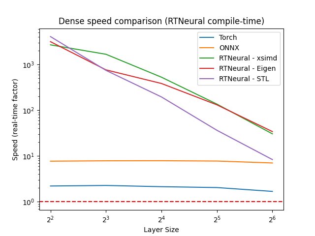
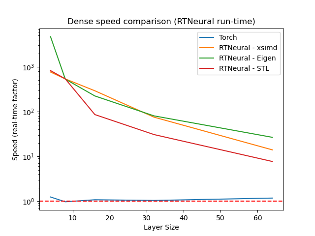

### Conv1D:

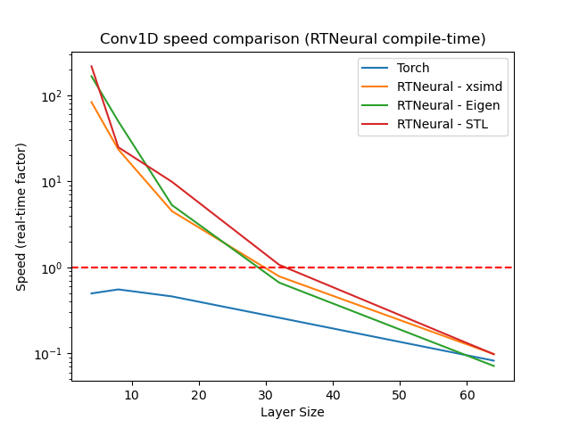
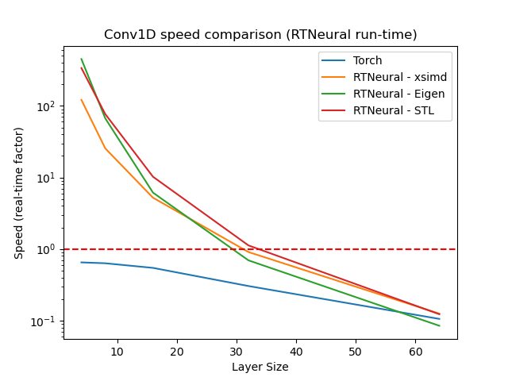

### GRU:

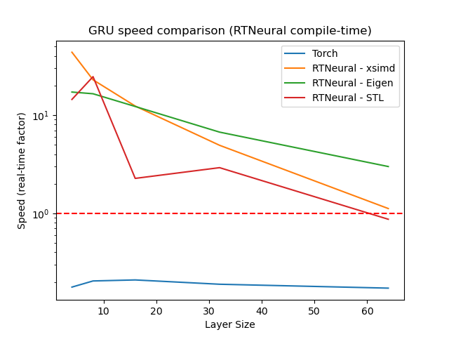
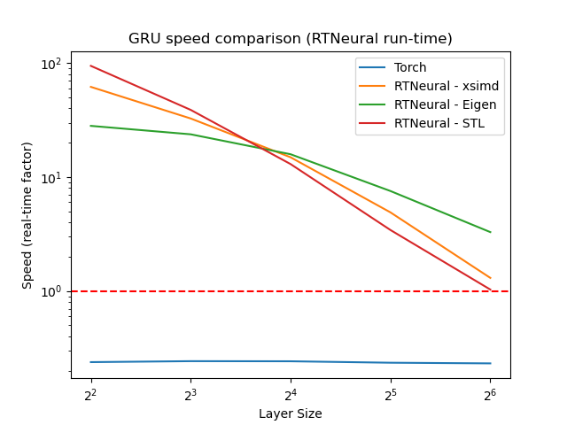

### LSTM:

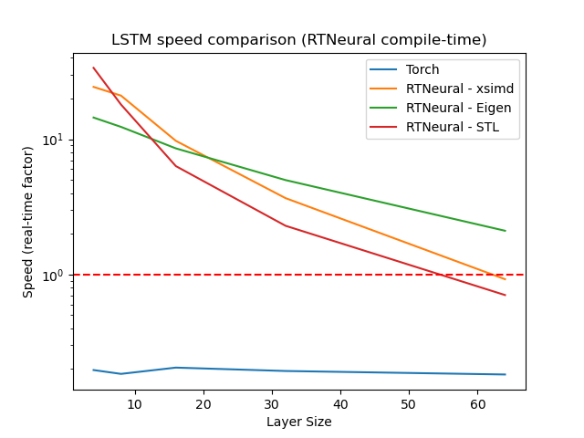
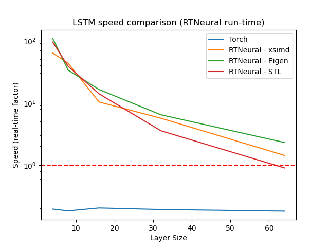

### Activations:

Tanh:
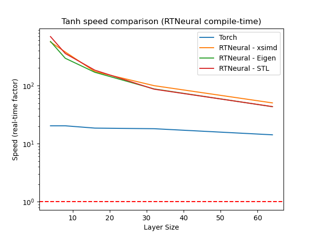
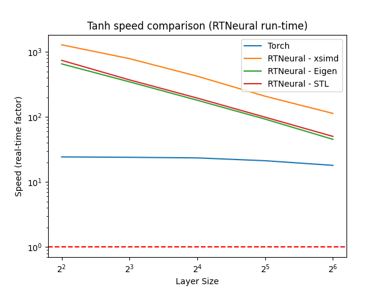

ReLU:
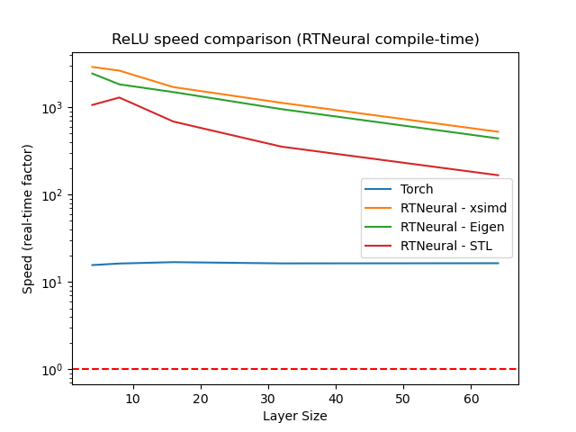
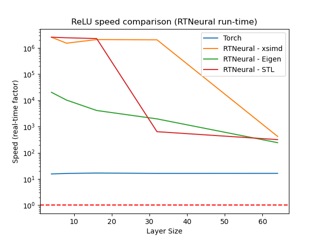

Sigmoid:
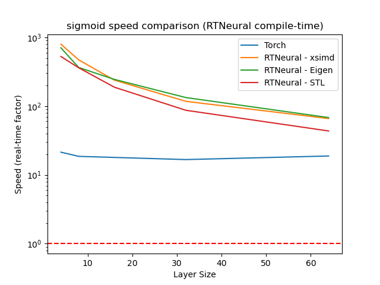
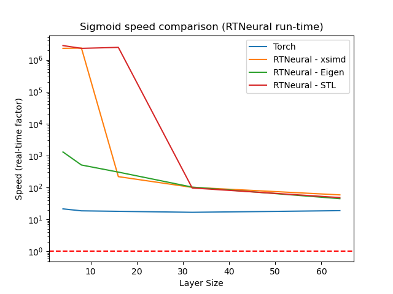
