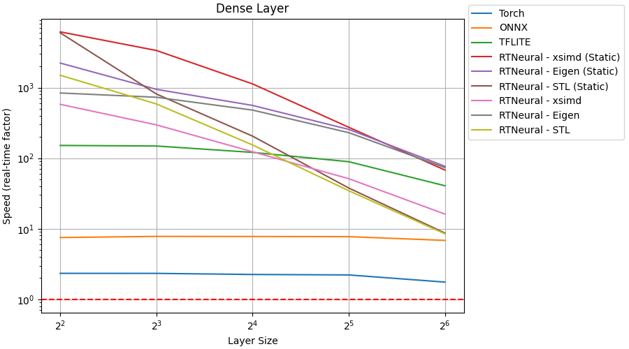
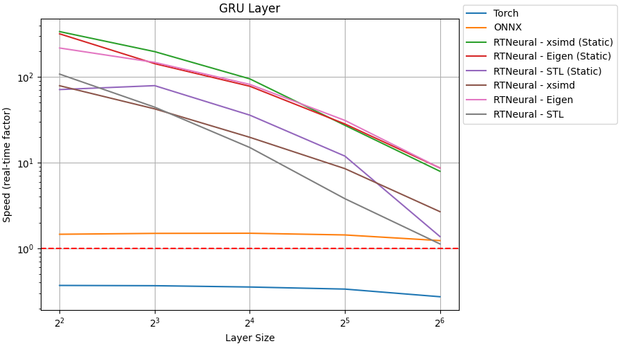
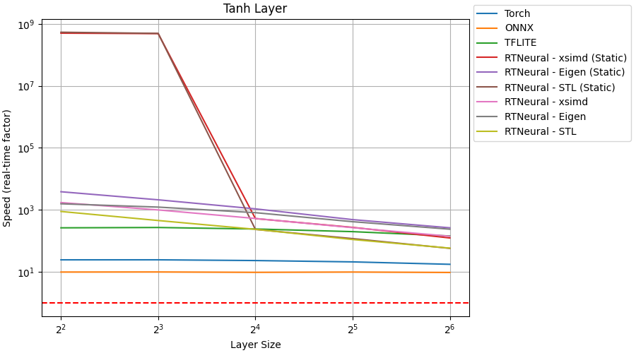
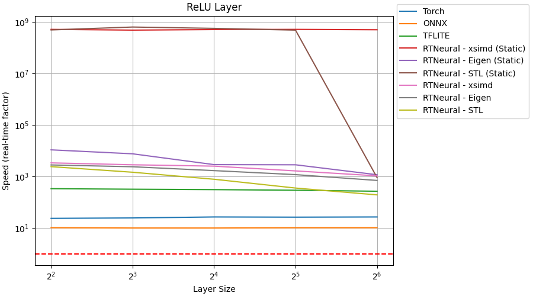
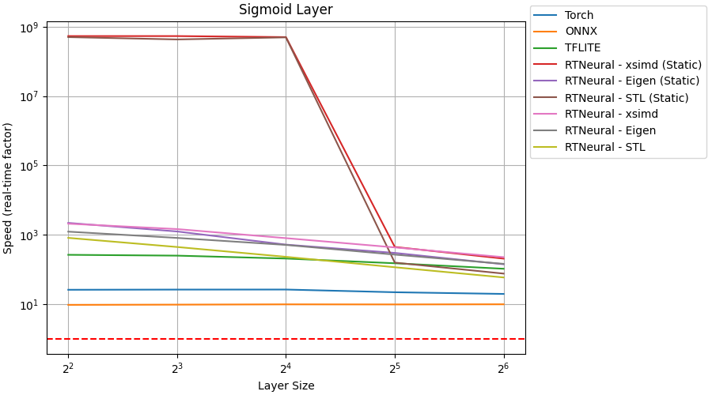

# RTNeural Comparisons

This repository contains an executable for comparing the performance
of C++ neural network inferencing engines. Currently, there are five
inferencing engines being compared:

- [RTNeural](https://github.com/jatinchowdhury18/RTNeural) (compile-time API)
- RTNeural (run-time API)
- [libtorch](https://pytorch.org/cppdocs/)
- [onnxruntime](https://github.com/microsoft/onnxruntime)
- [TensorFlow Lite](https://www.tensorflow.org/lite)

## Results
All benchmarks results were obtained on a 2018 Mac Mini with an Intel(R) Core(TM) i7-8700B CPU @ 3.20GHz.
The "Real-Time Factor" measurement assumes a sample rate of 48 kHz.

### Dense:

### Conv1D:

### GRU:

### LSTM:

### Activations:

Tanh:

ReLU:

Sigmoid:

